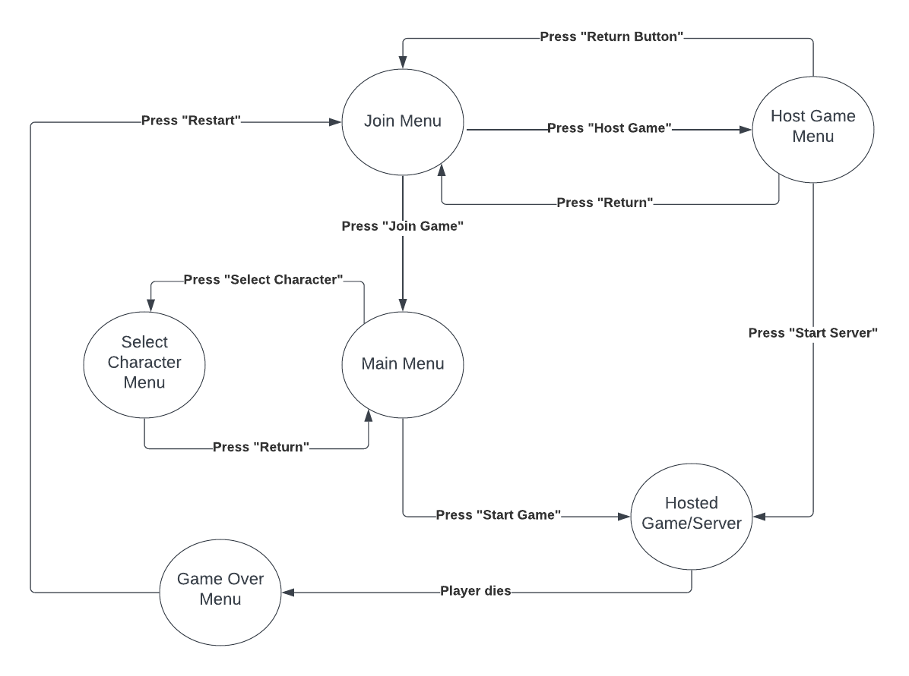

# Report Overview

In the realm of game development, creativity often intertwines with technical prowess, presenting unique challenges while crafting new opportunities. This documentation aims at presenting our group’s journey and experience in developing a 2D platformer game displaying our significant challenges and hurdles we had to overcome. The project itself is developed using the Python based Pygame library, facilitating the process by providing a wide array of built-in methods and imports at our disposal.

Central to our project’s identity is its server-client logic, a component that provided to be both challenging and crucial for the successful outcome of our project. This intricate architecture serves as the backbone of our game, enabling multiple players to interact within a shared digital universe seamlessly. The implementation of this feature was far from trivial; it required a deep understanding of network programming and synchronization principles. As we navigated through the complexities of ensuring fluid gameplay over networked environments, we realized that this was not just about coding efficiency but about creating a harmonious interconnected experience for the players.

Beyond the technicalities of networked play, our game introduces novel elements in player movement and collision mechanics. These are not mere programming features; they are the embodiment of our vision to elevate the gaming experience. By engineering unique movement dynamics and collision responses we crafted a gameplay environment which is both challenging and engaging. These elements compel players to think strategically making every jump, every interaction a deliberate and meaningful decision.

One of the most distinctive features of our game is the rope logic, integrated with a robust physics coding. This aspect of the game opens up a plethora of gameplay possibilities. The rope in fact becomes an extension of the player’s will, a tool that is as versatile as it is fun.

In the documentation, we will delve deeper into the intricacies of our project shedding light on the various components that build up our game and make it unique. The journey in fact has been as much about overcoming technical hurdles as it has been about crafting an experience which resonates with players.

# Server-Client Logic for Multiplayer Implementation

Rope Runner’s core engine is written in Python totaling around 3000 lines. The code's server architecture is designed to manage multiple client connections, player interactions, game state updates, and real-time communication. Key components include the Server class and the ClientHandler class which handle various game object classes such as Player, Rope, Lava, and more. The `Server` class, forming the core of the application, initializes a TCP socket server to manage incoming connections and maintains a list of `ClientHandler` instances, each dedicated to a specific client. It's responsible for managing game elements like players, platforms, lava blocks, and flags, along with broadcasting game updates and synchronizing the game state across all clients. On the other hand, the `ClientHandler` class focuses on individual client management, ensuring player readiness, and handling the game loop for state updates and client disconnections. Gameplay dynamics are enriched through various interactive objects and real-time updates based on client inputs, like movement and jumping. This architecture guarantees a synchronized, real-time gaming experience, making it ideal for fast-paced, multiplayer games requiring consistent state management across different clients.

The `GameLogicScreen` class in this Python script is a key component for a Pygame-based multiplayer game, handling visual rendering and game state updates. It initializes game elements like players, a rope, and lava blocks, and manages screen settings. The class processes player inputs (directional keys), updating the list of pressed keys or defaulting to 'idle'. It receives and integrates data updates, including player positions, game status, and game objects like the rope and flag. The `render` method dynamically displays these elements, adjusting their positions based on the camera's view, centered between players. The rope is rendered with a realistic Bezier curve for elasticity, and a "GAME OVER" message is displayed with a fade-in effect when the game ends. This class ensures a responsive and visually engaging gaming experience.

Throughout the journey of our group project, we navigated through various complexities underscored by a demanding learning curve. In fact, a critical juncture was our decision to entirely revamp the server script. This strategic move was essential not only to decrease the lag between two machines running the client script but also to cultivate a codebase which exemplified modularity and efficiency. This improvement was especially vital, bearing in mind that other peers might scrutinize our code at a later stage necessitating clarity and optimization.

A primary concern in our project was the architecture of server and client logic, particularly the server class which underwent multiple revisions. This posed a significant challenge for our team. Initially, our server client model was structured such that all objects were passed and created within the client class, which resulted in inefficiency and diminished game performance. To address this, we later transferred all object passing, collision detection, and movement functionalities to the server class hence meaning we created all objects and events inside of the server itself. This modification significantly reduced latency, enhanced performance, and simplified the creation of new Objects. However, this approach led to an unwieldy client class, inflating to almost 600 lines, primarily due to rendering requirements. Consequently, we opted to restructure the server and client classes in order to enhance modularity, creating separate classes for rendering and thus alleviating the complexity of the client codebase. This restructuring henceforth, not only improved code readability but also facilitated future peer review and code augmentation. The final server client logic involves handling various game objects like players, ropes, lava blocks, arrows, and flags represented all as Python classes with their own unique attributes, and when the server needs to send an object’s state to a client it first serializes the object to JSON. Serialization is the process of converting a data structure into a format that can be easily transmitted over the network. To address this in python we used the ‘json.dumps’ method.

Let's take an example:
```python

def to_json(self):
        return {
            'id': self.id,
            'x': self.x,
            'y': self.y,
            'rect_centerx': self.rect.centerx,
            'rect_centery': self.rect.centery,
            # ... other necessary attributes ...
        }
        
```


In this snippet, the `Player` class is defined with an `__init__` method to initialize its properties, and a `to_json` method to serialize its attributes into a JSON-friendly format. This is a typical way of handling object serialization in networked Python games. 

The dictionary can then be serialized as a JSON string. After serializing the game objects, the server sends this data to clients. This involves converting the JSON dictionary into a string and then sending it over the socket connection. Clients can also send data to the server, such as player input or game actions. This data is received as JSON strings, which the server then deserializes into Python objects to update the game state accordingly. The server updates game objects based on the received data. This typically involves altering the attributes of the objects (like position, state) and performing game logic (like collision detection, score updates). By using JSON for data interchange, the game server ensures that data is transmitted in a structured, readable, and language-independent format, which is crucial for a consistent and synchronized multiplayer gaming experience.




The Finite State Machine Above Demonstrates our Interface logic with regards to the server. The initial state, is the Join Menu Interface. Upon clicking `Host Game` the user will get redirected to the next state, which is the Host Game Menu. In this state, the user can either `return` to the Join Menu State, or, initiating the Server by pressing `Start Server`. If Pressed, the subsequent state will display that the Server has been started and the User will be prompted to go back to the Join Menu Screen. Next, the user will need to press `Join Game` in order to reach the Game Screen. If the player dies, then the Game Over menu will be set as a state and, the `Restart` button will reset the state back to the initial state.


# Rope

The ‘Rope’ class represents a software component designed for use in our 2D platformer game. In fact, a dynamic rope which connects two players within the game environment is presented. Its primary functions include maintaining a maximum length between players and visually rendering the rope with realistic properties such as tension and curvature. In the ‘Rope’ class, the ‘update’ method performs the core functionality by calculating the distance between two players determining the length between them. Next, it works at handling tension by determining if the distance exceeds the ‘max_length’, and if so computing the amount of pull needed to bring the players back within the maximum allowable distance. These in fact, are the two core logics performed by the rope within that method. The rope’s rendering involves calculating updated positions considering the camera’s offset, dynamically changing the rope’s color based on its tension. A realistic rope bend is also visualized whenever the rope is shorter than the maximum length. To Render the pleasing Rope animation, a Bezier's curve was utilised, in which two control points were set (0, and 1) and a mathematical formula was used to iterate over coordinates in order to generate the rope curve. From a more in depth view, the control points are initially calculated to determine the shape of the curve. Next, the cubic Bezier curve formula is applied in a loop, iterating over 't' from 0 to 1 in increments. For each 't' the x and y coordinates ('bx', 'by') of a point on the curve are calculated and added to a list called curve_points. If the rope's lenght exceeds the maximum or there are not enough points, then, a straight line is drawn. Else, the pygame.draw.lines is used to render the Bezier curve using the points calculated.

# Interface

We also worked on implementing a friendly user interface, adhering to proper user interaction design. It was keen to focus on usability rather than aesthetics emphasizing form over functionality. Aesthetics were nevertheless not undermined, and interactive sprites with animations, character selection, and simple navigation for the user was ensured. A further addition to our User Interface would include more interactive features for the user such as an option to view online games and to join them, thereby facilitating connections. In addition, clear text is added to indicate player actions and what to be done. Game ending conditions such as Game Over or You Win are clearly indicated as well hence helping the user.
